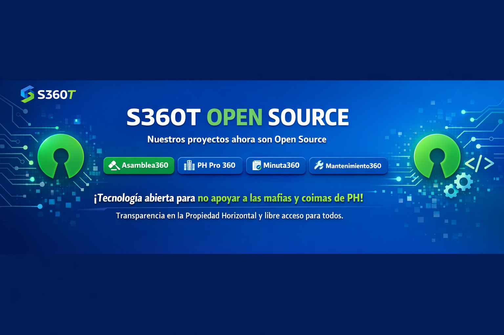
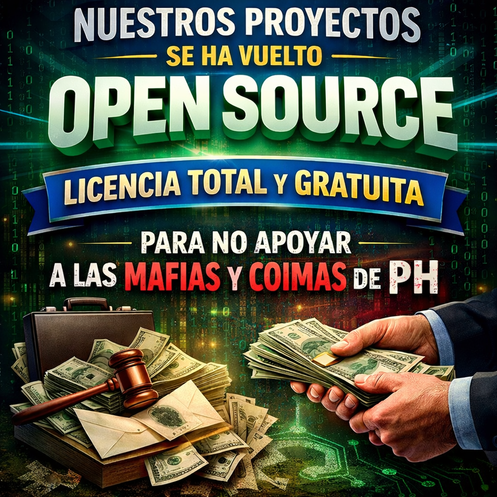

# 🤖 VERA - Asistente Virtual para Asambleas de Propiedad Horizontal

[](https://opensource.org/licenses/MIT)
[](https://n8n.io)
[](https://github.com/WhiskeySockets/Baileys)
[](https://reactjs.org)
[](https://supabase.com)

> **V**irtual **E**ncargada de **R**egistro y **A**creditación

VERA es un ecosistema de inteligencia artificial diseñado para gestionar asambleas de propiedad horizontal en Colombia. Incluye un asistente de WhatsApp, aplicación web de administración y sistema de votación en tiempo real.



---

## 💼 Asamblea360 — Sistema de Votación y Gestión

> **Plataforma completa para asambleas de propiedad horizontal: presenciales, virtuales o híbridas.**

Asamblea360 es el sistema de producción que integra VERA como motor de inteligencia artificial, permitiendo la realización de reuniones con votación digital desde WhatsApp, cálculo automático por coeficientes de propiedad y resultados en tiempo real.

### Funcionalidades Core

| Módulo | Descripción Técnica |
|--------|---------------------|
| **🗳️ Votación por WhatsApp** | Interfaz conversacional via Baileys + n8n. Votos firmados criptográficamente, validación de coeficientes en PostgreSQL |
| **📊 Control de Quórum en Vivo** | WebSocket + React Query. Actualización en tiempo real del porcentaje de representación presente |
| **🔐 Validación de Poderes** | Flujo de aprobación con OTP + firma digital. Registro inmutable en audit logs |
| **✅ Acreditación Inteligente** | QR dinámicos + escaneo desde web app. Verificación contra padrón de propietarios |
| **📈 Resultados Verificables** | Suma ponderada por coeficientes, registro hash de cada voto, exportación a PDF firmado |
| **📝 Actas con IA** | Generación automática de actas usando LLM (Groq/Llama), estructuradas según normativa colombiana |
| **🔗 Trazabilidad Completa** | Pipeline de eventos: registro de cada acción (acreditación, delegación, voto) con timestamp e IP |

### Arquitectura de Voto

```
┌─────────────┐     ┌─────────────┐     ┌─────────────┐     ┌─────────────┐
│  Propietario │────▶│   VERA AI   │────▶│  Validador  │────▶│   Registro  │
│  (WhatsApp)  │     │   (n8n)     │     │  (Supabase) │     │  (PostgreSQL│
└─────────────┘     └─────────────┘     └─────────────┘     └─────────────┘
       │                                        │                    │
       │              ┌─────────────┐           │                    │
       └─────────────▶│  Web App    │◀──────────┘                    │
                      │  (React)    │◀───────────────────────────────┘
                      └─────────────┘         Resultados en tiempo real
```

### Características Técnicas de Seguridad

- **Voto secreto**: Los votos se registran desvinculados del identity en tablas separadas
- **Integridad**: Hash SHA-256 de cada transacción para auditoría
- **Rate limiting**: Redis-based throttling por número de WhatsApp
- **Autenticación**: JWT + refresh tokens para web app, OTP para WhatsApp
- **RBAC**: Roles (admin, secretaría, propietario, delegado) con permisos granulares

> 🎯 **Objetivo**: Hacer las asambleas más participativas, transparentes y auditables.

---

## 🚀 Manifiesto Open Source

[](docs/manifiesto-opensource.png)

> **Nuestros proyectos se han vuelto Open Source con licencia total y gratuita.**

**¿Por qué?** Para no apoyar a las mafias y coimas de Propiedad Horizontal. Creemos que la tecnología debe ser un derecho, no un negocio opaco que favorezca la corrupción.

**Principios:**
- 🔓 **Código abierto** — Auditoría pública del sistema de votación
- 💰 **Gratuito** — Sin licencias, sin costos ocultos
- 🛡️ **Transparente** — Trazabilidad completa de cada decisión
- 🤝 **Colaborativo** — Mejorado por la comunidad de propietarios

---

## 🏗️ Arquitectura del Sistema

```
┌─────────────────────────────────────────────────────────────────┐
│                         VERA ECOSISTEMA                         │
├─────────────────────────────────────────────────────────────────┤
│                                                                 │
│  ┌──────────────┐     ┌──────────────┐     ┌──────────────┐    │
│  │   WhatsApp   │────▶│   n8n AI     │────▶│   Supabase   │    │
│  │   Usuario    │     │   Agent      │     │   Backend    │    │
│  └──────────────┘     └──────────────┘     └──────────────┘    │
│         │                                           ▲          │
│         │                                           │          │
│         └──────────────┐    ┌──────────────┐        │          │
│                        └───▶│   Web App    │────────┘          │
│                             │   Admin      │                   │
│                             └──────────────┘                   │
│                                                                 │
└─────────────────────────────────────────────────────────────────┘
```

### Componentes

| Componente | Tecnología | Descripción |
|------------|------------|-------------|
| **VERA AI** | n8n + Groq | Asistente conversacional por WhatsApp |
| **WhatsApp Gateway** | Baileys | Conexión con WhatsApp Web |
| **Web App** | React + Supabase | Panel de administración web |
| **Backend** | Supabase (PostgreSQL) | Base de datos, auth, APIs |
| **Colas** | Redis | Locks y rate limiting |

---

## 📁 Estructura del Repositorio

```
vera-asistente/
├── 📁 src/                      # Workflow n8n y prompts
│   ├── workflow.json            # Workflow principal VERA
│   └── SYSTEM-PROMPT-VERA-V6.txt
│
├── 📁 web-app/                  # Aplicación web React
│   ├── src/                     # Código fuente React
│   ├── supabase/                # Migraciones y Edge Functions
│   └── README.md                # Docs específicas de web-app
│
├── 📁 baileys/                  # Gateway de WhatsApp
│   ├── index.js                 # Servidor Baileys
│   └── Dockerfile
│
├── 📁 docs/                     # Documentación
│   └── SETUP.md                 # Guía de configuración
│
├── 📁 tests/                    # Testing
│   └── chat.html                # UI de testing
│
├── docker-compose.yml           # Orquestación completa
├── .env.example                 # Variables de entorno
└── README.md                    # Este archivo
```

---

## ✨ Funcionalidades

### 🤖 VERA AI (WhatsApp)

- **Acreditación digital** con verificación OTP
- **Generación de QR** para registro presencial
- **Delegación de poderes** (digital y presencial)
- **Votación en tiempo real** durante asambleas
- **Soporte conversacional** 24/7
- **Multi-tenant** por copropiedad

### 🌐 Web App

- **Dashboard** con estadísticas en tiempo real
- **Gestión de copropiedades** y unidades
- **Administración de asambleas**
- **Escaneo de QR** para acreditación
- **Proyección de resultados** en tiempo real
- **Gestión de usuarios** y permisos

---

## 🚀 Instalación Rápida

### Requisitos

- Docker 20.10+
- Docker Compose 2.0+
- Cuenta en [Groq](https://console.groq.com)
- Cuenta en [Supabase](https://supabase.com)
- Número de WhatsApp dedicado

### 1. Clonar y Configurar

```bash
git clone https://github.com/tu-usuario/vera-asistente.git
cd vera-asistente

# Configurar variables de entorno
cp .env.example .env
# Editar .env con tus credenciales
```

### 2. Iniciar Servicios Backend

```bash
docker-compose up -d
```

Esto inicia:
- PostgreSQL
- Redis
- n8n (http://localhost:5678)
- Baileys Gateway

### 3. Configurar Web App

```bash
cd web-app
cp .env.example .env
# Editar .env con credenciales de Supabase

npm install
npm run dev
```

### 4. Configurar n8n

1. Accede a http://localhost:5678
2. Importa `src/workflow.json`
3. Configura credenciales:
   - **Groq** - API Key para LLM
   - **PostgreSQL** - Conexión a Supabase
   - **Redis** - Para locks
4. Activa el workflow

### 5. Vincular WhatsApp

```bash
docker logs vera-baileys -f
```

Escanea el QR con WhatsApp del número dedicado.

---

## 📖 Documentación

| Documento | Descripción |
|-----------|-------------|
| [docs/SETUP.md](docs/SETUP.md) | Guía de configuración detallada |
| [web-app/README.md](web-app/README.md) | Documentación de la web app |
| [CONTRIBUTING.md](CONTRIBUTING.md) | Guía para contribuidores |

---

## 🔧 Variables de Entorno

### Backend (.env)

```env
# Base de Datos
POSTGRES_USER=vera
POSTGRES_PASSWORD=tu-password
POSTGRES_DB=vera_db

# n8n
N8N_ENCRYPTION_KEY=tu-clave-32-caracteres
N8N_WEBHOOK_URL=https://tu-dominio.com
N8N_USER=admin
N8N_PASSWORD=tu-password

# API Keys
GROQ_API_KEY=gsk_tu-api-key
RESEND_API_KEY=re_tu-api-key

# URLs
APP_QR_BASE=https://tu-dominio.com/qr
APP_ACREDITACION_URL=https://tu-dominio.com
```

### Web App (web-app/.env)

```env
VITE_SUPABASE_URL=https://tu-proyecto.supabase.co
VITE_SUPABASE_PUBLISHABLE_KEY=tu-anon-key
VITE_SUPABASE_PROJECT_ID=tu-project-id
```

---

## 🧪 Testing

### Test de VERA AI

```bash
curl -X POST http://localhost:5678/webhook/vera/whatsapp \
  -H "Content-Type: application/json" \
  -d '{"messages":[{"key":{"remoteJid":"573009999999@s.whatsapp.net"},"message":{"conversation":"Hola"}}]}'
```

### Test de Rate Limiting

```bash
for i in {1..12}; do
  curl -s -X POST http://localhost:5678/webhook/vera/whatsapp \
    -H "Content-Type: application/json" \
    -d "{\"messages\":[{\"key\":{\"remoteJid\":\"573001111111@s.whatsapp.net\"},\"message\":{\"conversation\":\"test $i\"}}]}"
  sleep 1
done
```

---

## 🤝 Contribuir

¡Las contribuciones son bienvenidas! Lee [CONTRIBUTING.md](CONTRIBUTING.md) para más información.

---

## 📄 Licencia

Este proyecto está licenciado bajo MIT License - ver [LICENSE](LICENSE).

---

## 🙏 Agradecimientos

- [n8n](https://n8n.io) - Automatización de workflows
- [Baileys](https://github.com/WhiskeySockets/Baileys) - WhatsApp Web API
- [Groq](https://groq.com) - Inferencia de LLM
- [Supabase](https://supabase.com) - Backend as a Service
- [shadcn/ui](https://ui.shadcn.com) - Componentes de UI

---

<p align="center">
  <strong>Made with ❤️ by Asamblea360 Team</strong><br>
  <sub>Transformando la propiedad horizontal en Colombia</sub>
</p>
