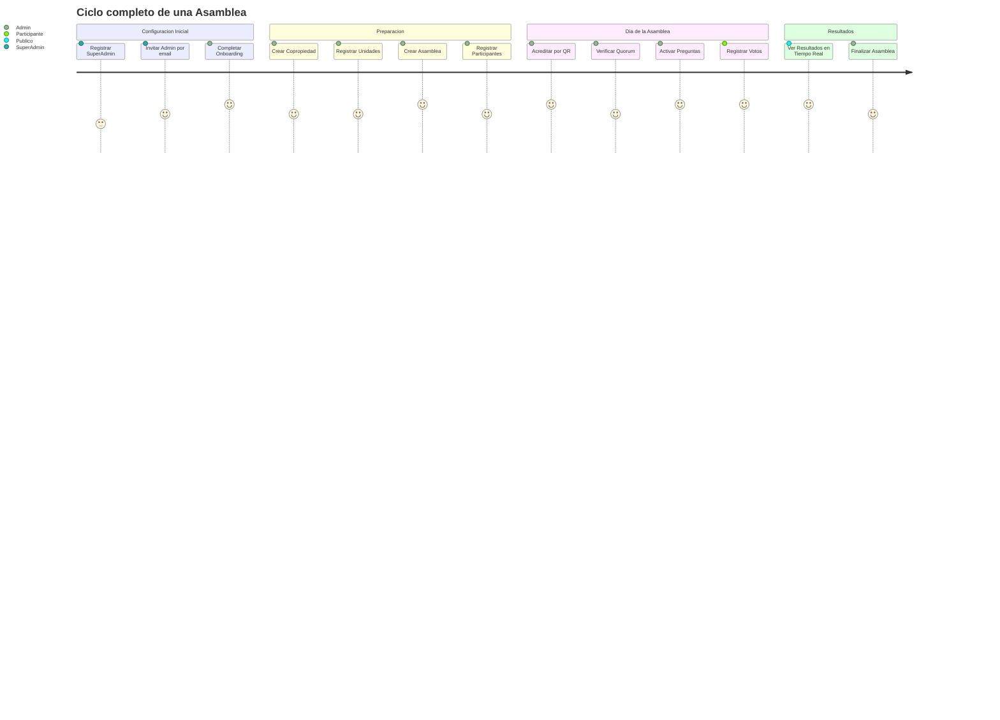
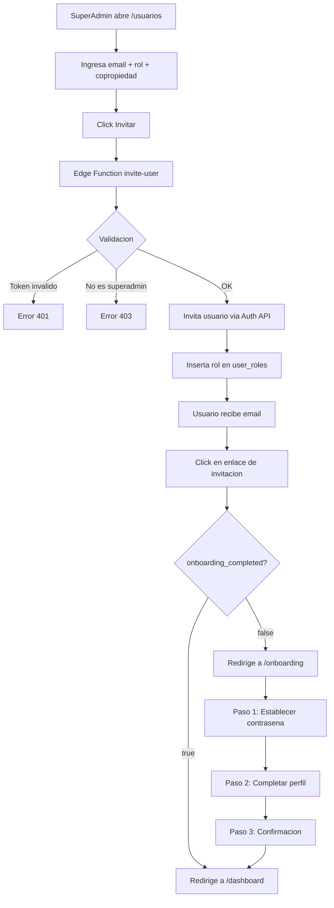
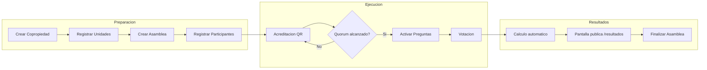
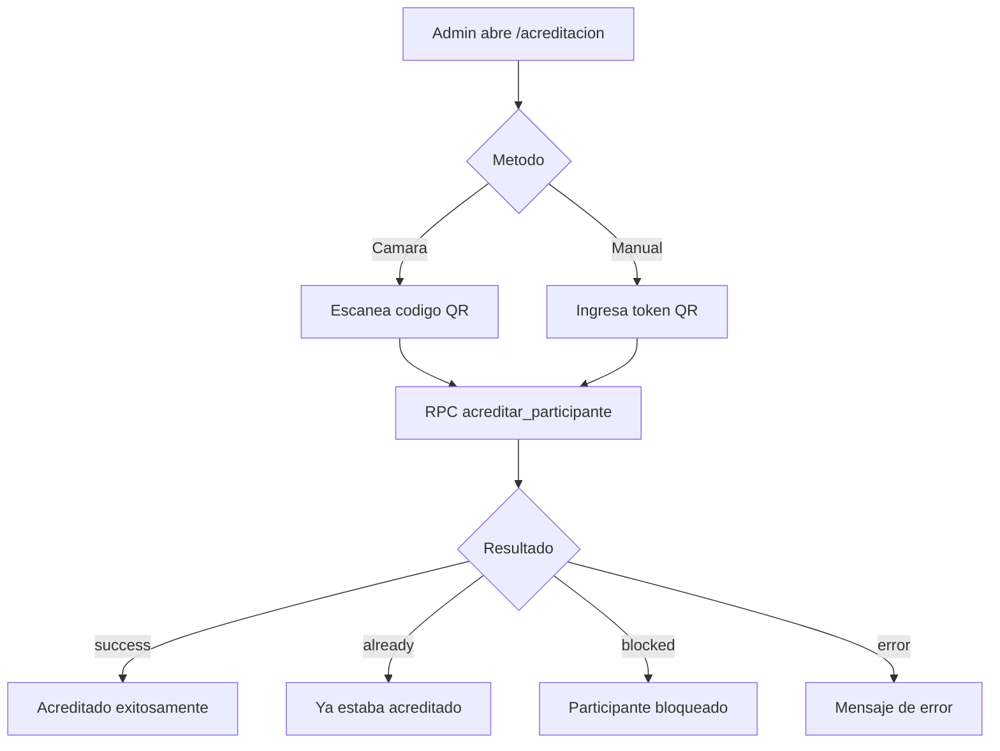
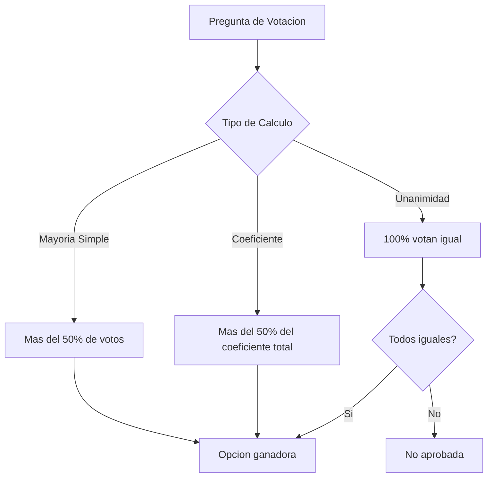

# Flujos de Negocio — Asamblea360

## Diagrama General: User Journey



## Diagrama: Flujo de Invitacion y Onboarding



## Diagrama: Flujo de Asamblea Completa



## Diagrama: Proceso de Acreditacion QR



## Diagrama: Tipos de Calculo de Votacion



---

## 1. Configuración Inicial

### 1.1 Registro del SuperAdmin
El primer usuario se registra manualmente y se le asigna el rol `superadmin` directamente en la base de datos.

### 1.2 Invitación de Admins
```
SuperAdmin accede a /usuarios
  → Ingresa email + rol (admin/viewer) + copropiedad (opcional)
  → Click "Invitar"
  → Frontend llama a Edge Function invite-user
  → Edge Function:
      1. Valida token JWT del caller
      2. Verifica rol superadmin en user_roles
      3. Llama auth.admin.inviteUserByEmail(email)
      4. Inserta registro en user_roles
  → Usuario recibe email de invitación
  → Click en enlace → llega a la app
  → Detecta onboarding_completed = false → redirige a /onboarding
```

### 1.3 Onboarding (3 pasos)
```
Paso 1: Establecer contraseña
  → supabase.auth.updateUser({ password })

Paso 2: Completar perfil
  → Ingresa nombre completo
  → UPDATE profiles SET full_name, onboarding_completed = true

Paso 3: Confirmación
  → Click "Ir al Dashboard" → navigate('/dashboard')
```

---

## 2. Gestión de Copropiedades

```
Admin → /copropiedades
  → "Nueva" → Dialog con formulario (nombre*, NIT, dirección, email)
  → INSERT INTO copropiedades
  → Listar en tabla con acciones Editar/Eliminar
```

---

## 3. Gestión de Unidades

```
Admin → /unidades
  → "Nueva" → Seleccionar copropiedad + identificador + tipo + propietario + coeficiente
  → INSERT INTO unidades
  → El coeficiente es un valor numérico que representa la participación en la propiedad
```

---

## 4. Flujo Completo de Asamblea

### 4.1 Crear Asamblea
```
Admin → /asambleas → "Nueva"
  → Seleccionar copropiedad
  → Título, fecha de inicio, estado
  → INSERT INTO asambleas (estado: "programada")
```

### 4.2 Registrar Participantes
```
Admin → /participantes → "Nuevo"
  → Seleccionar asamblea + unidad
  → Nombre, email, teléfono
  → INSERT INTO participantes_asamblea
  → Se genera qr_token automáticamente (gen_random_uuid)
```

### 4.3 Acreditación
```
Admin → /acreditacion
  → Tab "Cámara": Escanea QR del participante
  → Tab "Manual": Ingresa token QR manualmente
  → Llama RPC acreditar_participante(qr_token)
  → Retorna:
      success → "Acreditado exitosamente" + nombre
      already → "Ya estaba acreditado"
      blocked → "Participante bloqueado"
      error   → Mensaje de error
```

### 4.4 Crear Preguntas
```
Admin → /preguntas → "Nueva"
  → Seleccionar asamblea
  → Título de la pregunta
  → Tipo de cálculo: mayoría simple | coeficiente | unanimidad
  → Activar/desactivar con switch
```

### 4.5 Votación
Los votos se registran en `registro_votos` con:
- `pregunta_id`: La pregunta votada
- `participante_id`: Quién votó
- `opcion`: La opción elegida (ej: "Sí", "No", "Abstención")

### 4.6 Resultados en Tiempo Real
```
Pantalla pública → /resultados/:asambleaId (sin auth)
  → Muestra: nombre asamblea, copropiedad, estado
  → Quórum: barra de progreso (coeficiente acreditado / total)
  → Por cada pregunta:
      → Gráfica de barras horizontal
      → Porcentajes por opción
      → Indicador de ganador (si aplica)
  → Actualización: Realtime (postgres_changes) + polling cada 5s
```

---

## 5. Delegaciones

```
Registro de poderes de representación
  → Tipo: presencial
  → Estado: pendiente → aprobada | rechazada
  → Documento de soporte (URL)
  → Asociada a participante + asamblea
```

---

## 6. Soporte

```
Tickets de soporte
  → Mensaje del participante
  → Estado: pendiente → en_proceso → resuelto
  → Prioridad: baja | media | alta
  → Respuesta del admin
  → Filtrado por estado
```

---

## 7. Conversaciones WhatsApp (Bot Vera)

```
Historial de mensajes de WhatsApp
  → Roles: user (participante) | assistant (bot Vera)
  → Búsqueda por texto
  → Vista tipo chat con burbujas
  → Límite de visualización: 200 mensajes
```
